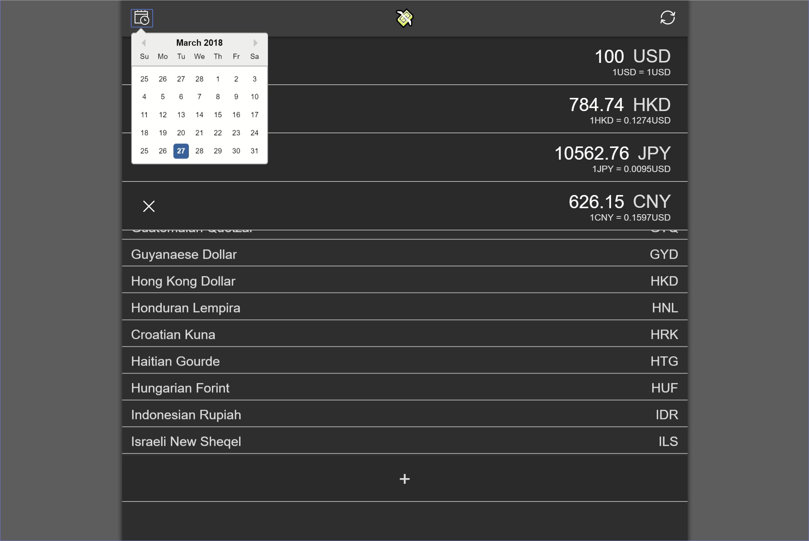

# Currency converter - Aftership challenge

## Description of the problem and solution.

### Problem
Create a single-page app that can
- Show exchange rate of various currencies
- Show historical exchange rates
- A three-tier network should be adopted

### Solution

#### Function list
- Click the bottom "+" icon will bring the new currency options sub-menu
	- The first row "Cancel" is for close the list
	- You can use touchmove/mousewheel to scroll the list
	- Click any row will add it to the currency list
- You can edit any row of currency value. All the others will be re-calculated automatically
- Double tapping any row of currency will set it to 100 for convenience
- The currecy list will automatically save in local storage
- Tap the top-left calendar icon to change date to view historical exchange rate
- Tap the top-right refeash icon to update latest exchange rate

## Whether the solution focuses on back-end, front-end or if it's full stack.

The solution is full stack.
> The front-end is built seperately in this [repo](https://github.com/Houdou/CurrencyConverter).

## Reasoning behind your technical choices, including architectural.

#### Technical choices
##### Application layer
- React for the front-end app.
> You like React, so I had a try! Actually, this is the first time I use React.

> Like what I usually do when learning new framework, I learn React by doing this project.

##### Business logic layer
- Node.js for hosting app files and handling business logic
- Redis for cache server

> As the exchange rates will not change frequently, to reduce the data layer access, a redis server is used for caching the exchange rates previously requested.

##### Core data layer
- [openexchangerates.org](http://openexchangerates.org) for the exchange rates data.

##### Architectural
I seperate the data source from the business logic server, so that the scalability is improved.
Also, as mentioned above, the exchange rate data will not change frequently. Therefore, a caching server can help reducing the request to data server. The Node.js server will only request the data api if the exchange rate cache is not available for the requested time.

##### 3rd-party libraries
- Front-end
	- [Swiper](https://www.npmjs.com/package/react-id-swiper) for scrollable-list
	- [Hammer](https://www.npmjs.com/package/react-hammer) for cross-platform double tap gesture
	- [Datapicker](https://reactdatepicker.com/) for historical date choice
	- [moment](http://momentjs.com/) for handling datetime types
- Back-end
	- [express](http://expressjs.com/) for handling application requests
	- [request](https://www.npmjs.com/package/request) for requesting data api

## Trade-offs you might have made, anything you left out, or what you might do differently if you were to spend additional time on the project.
- Test
	- I am not that experienced in unit test. I would like to learn more about front-end test.
- UI/UX
	- A search filter in new currency list
	- Make the app more responsive to different mobile devices. (For now, most common screen sizes are okay except iPhoneSE)
	- Add some animation when updating things
- Backend
	- Add different data source for robustness when one source is down

## Link to other code you're particularly proud of.
[ghostnight](https://github.com/Houdou/ghostnight), A 2D RTS multiplayer web game based on NodeJS, Express, CreateJS and Socket.IO.

## Link to to the hosted application where applicable.
[Heroku](http://currency-converter-pt.herokuapp.com)
> I use a free plan. The Heroku warns me that it will sleep after 30 mins of inactivity.

> If the Heroku app is unavailable, please [email me](mailto:tpengac@connect.ust.hk).